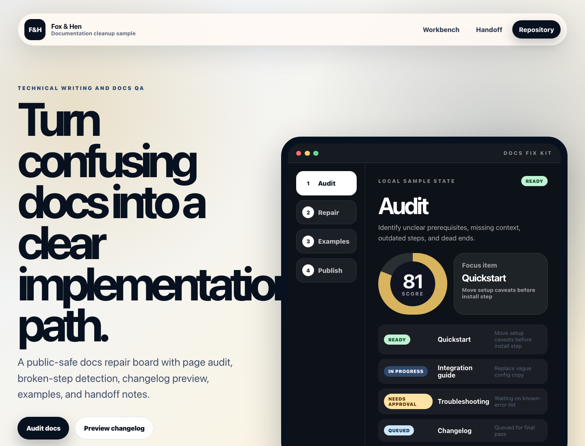

# Docs Fix Kit

Public Fox & Hen portfolio sample for **Technical writing and docs QA**.



## Live Demo

- Demo: [https://foxhen-docs-fix-kit.vercel.app](https://foxhen-docs-fix-kit.vercel.app)
- Repository: [https://github.com/foxandhenllc/foxhen-docs-fix-kit](https://github.com/foxandhenllc/foxhen-docs-fix-kit)

## What This Demonstrates

- Fits paid docs fixes, technical writing, and product education work.
- Shows product sense and reader empathy.
- Uses fictional docs content only.

## Interactions To Try

- Click through the workflow stage cards.
- Adjust the sprint-intensity range control.
- Toggle scope, QA, handoff, and reuse checks to change the readiness score.
- Review the handoff package and timeline sections.

## Local Run

```bash
npm install
npm run dev
npm run build
```

## Public-Safe Scope

This is a static React/Vite demo with fictional sample data. It includes no production data, credentials, real contacts, or copied customer work. It is intended to show Fox & Hen's workflow, product judgment, and delivery style for fast fixed-scope service work.
